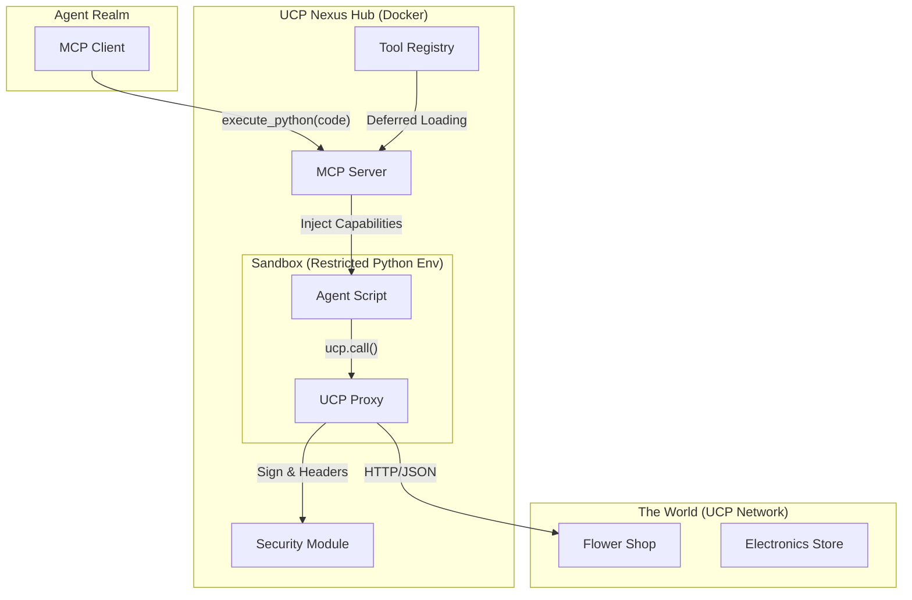

# UCP Nexus Hub: Agentic Commerce Bridge

<div align="center">
  
  
  
  
</div>

---

## Introduction

The **UCP Nexus Hub** is a Model Context Protocol (MCP) Server that empowers AI Agents (like Claude) to interact with the physical world via the **Universal Commerce Protocol (UCP)**.

Unlike traditional "function calling" implementations that expose rigid, discrete tools, this project implements **Code Mode**. It provides agents with a secure, sandboxed Python environment where they can "think in code," orchestrating complex multi-step commerce workflows (Discovery -> Negotiation -> Transaction) in a single turn.

### Why UCP Nexus?

**Instant AI-Readiness for Merchants.**

If a merchant implements UCP, this tool allows them to be **"plugged" instantly into any MCP-supported LLM**, without needing to configure a specific AI tool server. It acts as a universal adapter, converting any UCP business profile into a dynamic, intelligent MCP interface.

### Key Innovations

- **Code Mode & Orchestration**: Agents write and execute Python scripts to solve problems, reducing latency and context switching.
- **Secure Protocol Translation**: Automatically injects cryptographic headers (`idempotency-key`, `request-signature`) and validates schemas compliant with UCP.
- **Context Efficiency**: Uses a deferred loading registry (Regex-based tool search) to handle thousands of potential merchant tools without overwhelming the agent's context window.
- **Production-Grade Security**: Implements Ed25519 signing and JWT (AP2 Mandates) for secure payments.

---

## Architecture

The system acts as a middleware between the Agent (Client) and the decentralized UCP Network (Merchants).



---

## Technical Deep Dive

### 1. Code Mode Implementation (`src/ucp_hub_mcp/sandbox.py`)

We allow the agent to solve problems computationally.

- **Restricted Environment**: We use a custom `Sandbox` class that whitelists only safe globals (e.g., `print`, `math`, `datetime`) and blocks dangerous IO operations, ensuring security while maintaining flexibility.
- **Tool Injection**: The `UCPProxy` object is injected directly into the sandbox scope as `ucp`. This allows the agent to write natural scripts like:

  ```python
  services = await ucp.discover("http://localhost:8182")
  await ucp.call("dev.ucp.shopping.checkout", currency="USD", ...)
  ```

### 2. Universal Protocol Proxy (`src/ucp_hub_mcp/sandbox.py`)

The `UCPProxy` is the intelligent core that translates Python method calls into conformant HTTP requests.

- **Heuristic Routing**: It automatically detects if a `call` is a **Create** (`POST /root`), **Update** (`PUT /{id}`), or **Transition** (`POST /{id}/action`) operation based on payload analysis and explicit flags (`_action`).
- **Header Injection**: It ensures every request has:
  - `request-id`: UUIDv4 traceability.
  - `idempotency-key`: Preventing duplicate charges.
  - `request-signature`: Cryptographic proof of origin.

### 3. Context Efficiency (`src/ucp_hub_mcp/registry.py`)

The Registry handles the "Discovery Problem". A merchant might offer 50+ tools (Search, Cart, Payment, Reviews). Sending all 50 schemas to the agent consumes too many tokens.

- **Deferred Loading**: We store tool definitions in memory but only expose a `tool_search` tool to the agent initially.
- **Just-in-Time Exposure**: The agent searches for "checkout", and only *then* does the registry inject the full JSON schema for the Checkout tool into the context.

### 4. Security & Payments (`src/ucp_hub_mcp/security.py`)

Commerce requires trust. We moved beyond simple API keys to robust cryptography.

- **Algorithm**: Ed25519 (via `libsodium`/`cryptography`).
- **AP2 Mandates**: When an agent selects a payment method (e.g., Google Pay), the Hub generates a specific **JWT Mandate**. This token authorizes *only* that specific transaction amount and currency, preventing replay attacks or amount tampering.

---

## Tool Definition & Usage

The Hub exposes a single, powerful tool for orchestration.

### `execute_python`

This tool provides a sandboxed Python environment for the agent to orchestrate the commerce lifecycle.

**Input Schema:**

```json
{
  "code": "string (Required)"
}
```

**Environment Capabilities:**
The script runs in a restricted scope with the following available:

1. **`ucp` (Injected Object)**: The bridge to the UCP Network.
    - `await ucp.discover(url: str)`: Scans a merchant's `.well-known/ucp` to load available tools.
    - `await ucp.call(tool_name: str, **kwargs)`: Executes a UCP capability (e.g., `checkout`, `catalog`).
    - `await ucp.select_payment_method(handler_id: str, amount: float, currency: str)`: Generates a secure AP2 Mandate.

2. **Allowed Python Modules**:
    - `math`, `datetime`, `json`, `random`, `uuid`.
    - Standard primitives (`dict`, `list`, `print`, `len`).

**Example Usage:**

*User:* "Buy a red rose from <http://localhost:8182>" (or your specific UCP URL)

*Agent Output (Tool Call):*

```python
# 1. Inspect the merchant (Replace URL with your target)
services = await ucp.discover("http://localhost:8182")

# 2. Create a checkout session using the discovered 'dev.ucp.shopping.checkout' tool
checkout = await ucp.call(
    "dev.ucp.shopping.checkout",
    currency="USD",
    line_items=[{"quantity": 1, "item": {"id": "red_rose"}}]
)

print(f"Checkout created with ID: {checkout['id']}")
```

---

## Getting Started

### Prerequisites

- [Docker](https://docs.docker.com/get-docker/) installed.
- **Claude Desktop** (or any MCP-compatible client).

### 1. UCP Merchant Server

Ensure you have a UCP-compliant merchant server running and accessible.
The Hub connects to any UCP endpoint (e.g., `http://localhost:8182`, `https://api.my-store.com`).

### 2. Deploy the Hub (Docker)

Build the image:

```bash
cd ucp_hub_mcp
docker build -t ucp-hub-mcp .
```

### 3. Configure Claude Desktop

Edit your configuration file:

- **macOS**: `~/Library/Application Support/Claude/claude_desktop_config.json`
- **Windows**: `%APPDATA%\Claude\claude_desktop_config.json`

Add the server:

```json
{
  "mcpServers": {
    "ucp-hub": {
      "command": "docker",
      "args": [
        "run",
        "-i",
        "--rm",
        "--network", "host",
        "ucp-hub-mcp"
      ]
    }
  }
}
```

### 4. Interactive Verify

Open Claude and ask:
> "Access the local UCP network at <http://localhost:8182>. Discover the available services and place an order for a bouquet of red roses using code."

---

## Local Development & Contribution

If you want to extend the Hub functionality:

1. **Install uv**:

   ```bash
   pip install uv
   ```

2. **Install Dependencies**:

   ```bash
   uv sync
   ```

3. **Run Locally (No Docker)**:

   ```bash
   uv run src/ucp_hub_mcp/server.py
   ```

---

## Project Origins

This project was built to demonstrate that **Agentic Commerce** is not about chat, but about **action**. By combining the **Model Context Protocol (MCP)** for agent-tool communication with the **Universal Commerce Protocol (UCP)** for standardized merchant interactions, we create a world where AI doesn't just "browse" the web—it transacts with it.
